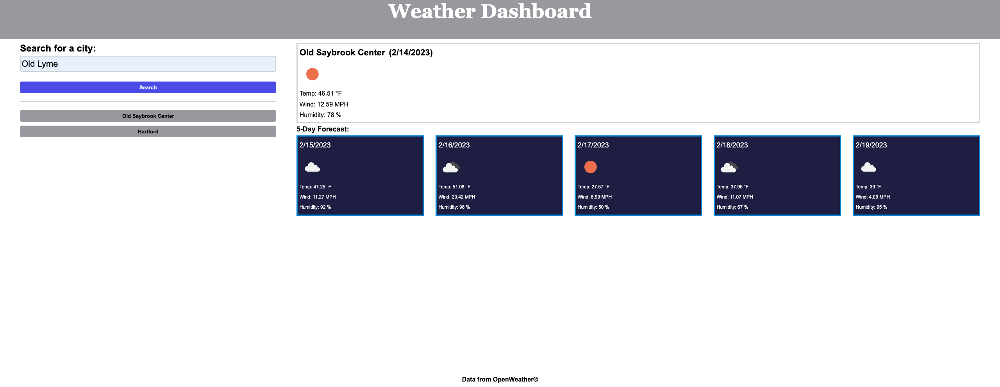
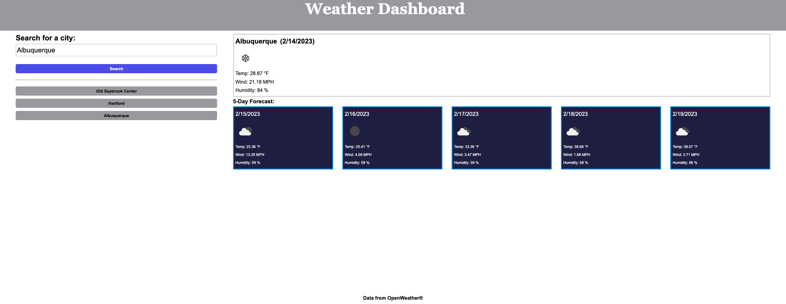

# weather-dashboard

## Description 

We were given a challenge to build a weather dashboard that will run in the browser and feature dynamically updated HTML and CSS. We were 
to use the 5 Day Weather Forecast API to retrieve weather data for cities. The searched data will be persistent so the user can see which cities they have looked up when the page refreshes.

The user story for this project is:

As a ... traveler 
I want ... to see the weather outlook for multiple cities 
So that ... I can plan a trip accordingly 

## Site Preview

## Links

[Link to GitHub Repositorty for Weather Dashboard](https://github.com/jrwesch/weather-dashboard)   
[Link to GitHub Pages view of website](https://jrwesch.github.io/weather-dashboard)